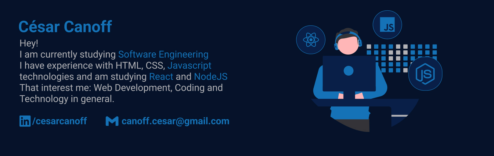

<h3>Main Skills</h3>

<!-- ----------------------------------- -->

<h3>Tools | IDEs</h3>

<!-- ----------------------------------- -->

<h3>I'm Studying</h3>

<!-- ----------------------------------- -->

<h3>I'll Learning</h3>

 
<!-- ----------------------------------- -->

 
 

 

 
<!--
 LINKS USED
- https://github.com/Ileriayo/markdown-badges
- https://undraw.co/illustrations
- https://icongr.am
- https://simpleicons.org
--> 
